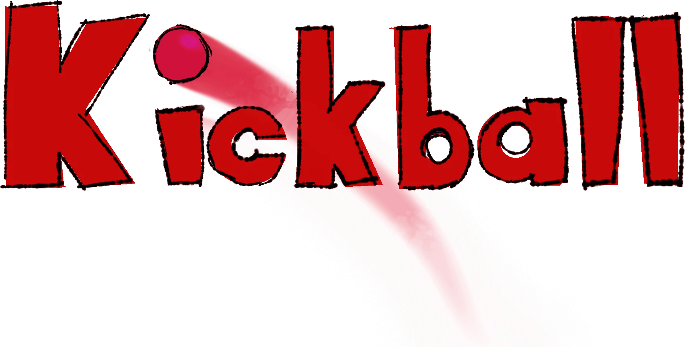

<!-- PROJECT LOGO -->
 

  

  <h3 align="center">Kickball Comedy Los Angeles</h3>

  

     
    <a href="https://github.com/JustinWested/Kickball/"><strong>Explore the docs »</strong></a>
     
    <a href="https://kickballcomedy.pages.dev">View Site</a>
  

<!-- TABLE OF CONTENTS -->

  
Table of Contents

  <ol>
    <li>
      <a href="#about-the-project">About The Project</a>
      <ul>
        <li><a href="#built-with">Built With</a></li>
        <li><a href="#interesting-features">Interesting Features</a></li>
      </ul>
    </li>
    <li><a href="#contact">Contact</a></li>
    <li><a href="#acknowledgments">Acknowledgments</a></li>
  </ol>

<!-- ABOUT THE PROJECT -->
## About The Project

  

 
A simple website meant to consolidate all of the information for the Kickball Comedy group in one, easy to access place. Has team bios, links to their sketch recordings, and links to their ticketing all contained in a interesting to scroll website that symbolizes the groups weird and wacky style of comedy. The group wanted something that was simple to use but also had a lot of personality. 

(<a href="#readme-top">back to top</a>)

### Built With

* 
* 
* 

(<a href="#readme-top">back to top</a>)

### Interesting Features

  <video src="https://github.com/JustinWested/Kickball/assets/32820532/784bd403-ddaa-4946-8999-ee2c643a29ce">

   
  Probably one the feature I've had the most fun creating and implementing for a client are a series of entertaining character sketches that are drawn overtop of the team members as the users scroll. The drawings were created as SVGs that draw their path with some simple CSS animation. A light touch of JS is used to make sure the animation triggers at the correct point in the page as a user scrolls. Currently the SVG code is directly inline of the HTML; this has the side effect of ballooning the number of code lines in th HTML. While not preferable, with the website itself being only one page, it's fairly easily manageable. In a more in-depth, larger site I would invest more time into injecting the SVG rather than having them inline.         

<!-- CONTACT -->
## Contact

Justin Wested - [LinkedIn](https://www.linkedin.com/in/justin-wested/) - justwested@gmail.com

Project Link: [https://github.com/JustinWested/Kickball](https://github.com/JustinWested/Kickball)

(<a href="#readme-top">back to top</a>)

<!-- ACKNOWLEDGMENTS -->
## Acknowledgments

* [Font Awesome](https://fontawesome.com)
* [Kickball Comedy](https://www.eventbrite.com/e/house-night-kickball-whoops-sketch-tickets-405923446957)
* [Cloudflare Pages](https://pages.cloudflare.com/)

(<a href="#readme-top">back to top</a>)

